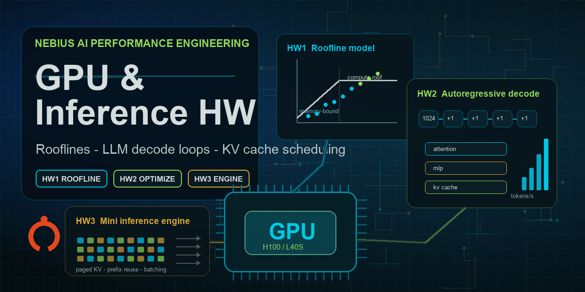

# Homework



## Contents

- `hw1/` (40 pts): implement and benchmark operations with different arithmetic intensity. **Requires a GPU** (L40S, H100, or H200).
- `hw2/` (60 pts): profile and optimize an autoregressive generation loop. **Requires a GPU** (L40S is the default because the speedup targets were calibrated against it).
- `hw3/` *(optional, ungraded)*: build the memory and scheduling core of a mini LLM inference engine. **Runs on CPU — no GPU needed.**

HW1 and HW2 together add up to **100 points**. See each subfolder's `README.md` for the per-part point breakdown and the expected submission format.

## Homework Guides

- [HW1 guide](doc/hw1.md): roofline benchmark implementation and outputs.
- [HW2 guide](doc/hw2.md): generation-loop profiling and optimization.
- [HW3 guide](doc/hw3.md): mini inference-engine cache and scheduler.

## Setup

```bash
sudo apt-get install -y python3-dev build-essential
python3 -m venv .venv
source .venv/bin/activate
python -m pip install --upgrade pip
python -m pip install -r requirements.txt
```

---

Use a fresh virtualenv for this repo. Reusing an older environment with extra packages can create version conflicts with the pinned dependencies.

See the `README.md` inside each subfolder for task details, requirements, and expected outputs.

## Nebius Cloud Experiments

HW1 and HW2 need a CUDA GPU. The project includes scripts for an end-to-end
Nebius run: create a GPU VM, upload the repo, install the same OS prerequisites
listed in setup, run HW1/HW2/HW3, collect results, stop the VM, and delete the
VM plus boot disk.

### 1. Install and Configure Nebius CLI

Install the CLI on your local machine:

```bash
curl -sSL https://storage.eu-north1.nebius.cloud/cli/install.sh | bash
exec -l "$SHELL"
nebius version
```

Create or select a Nebius profile:

```bash
nebius profile create
```

Install local helper tools used by the scripts:

```bash
brew install jq
```

### 2. Fill `.env`

At minimum, set your project ID:

```bash
NEBIUS_PROJECT_ID=<your_project_id>
```

Optional overrides:

```bash
NEBIUS_PLATFORM=gpu-l40s-a
NEBIUS_PRESET=1gpu-16vcpu-64gb
NEBIUS_SUBNET_ID=<subnet_id_if_auto_discovery_is_not_enough>
REMOTE_USER=user
REMOTE_WORKDIR=gpu_and_inference_hw
```

Supported GPU configurations:

| GPU | `NEBIUS_PLATFORM` | `NEBIUS_PRESET` | Notes |
| --- | --- | --- | --- |
| L40S | `gpu-l40s-a` | `1gpu-16vcpu-64gb` | Default for new runs; HW2 rubric was calibrated here. |
| H100 SXM | `gpu-h100-sxm` | `1gpu-16vcpu-200gb` | Used for the collected H100 results. |
| H200 SXM | `gpu-h200-sxm` | `1gpu-16vcpu-200gb` | Fastest memory path; useful for extra experiments. |

### 3. Run the Full Lifecycle

From the project root:

```bash
./scripts/01_create_vm.sh
./scripts/02_upload_repo.sh
./scripts/03_run_all.sh
./scripts/04_collect_results.sh
./scripts/05_stop_vm.sh
./scripts/06_delete_vm.sh
```

`01_create_vm.sh` writes generated values such as `NEBIUS_VM_ID`,
`NEBIUS_BOOT_DISK_ID`, `REMOTE_HOST`, and SSH key paths back into `.env`.

### 4. Run One Homework at a Time

After VM creation and upload, you can run individual jobs:

```bash
./scripts/run_hw1.sh
./scripts/run_hw2.sh
./scripts/run_hw3.sh
./scripts/04_collect_results.sh
```

Additional HW2 experiments can be run after the standard HW2 script:

```bash
./scripts/run_hw2_static_cache.sh
./scripts/run_hw2_dynamic_cache_v2.sh
./scripts/run_hw2_custom_kv.sh
./scripts/04_collect_results.sh
```

### 5. Result Locations

Remote results are copied into:

```text
results/<VM_NAME>/hw1/
results/<VM_NAME>/hw2/
results/<VM_NAME>/hw3/
```

Expected artifacts:

- HW1: `roofline.png`, `roofline_data.json`, `hw1_run.log`
- HW2: `v0_slow_trace.json`, `v1_optimized_trace.json`, `hw2_run.log`, plus
  optional experiment logs such as `hw2_static_cache_run.log`,
  `hw2_dynamic_cache_v2_run.log`, and `hw2_custom_kv_run.log`
- HW3: `hw3_results.png`, `hw3_policy_results.png`, `hw3_tests.log`, `hw3_run.log`

Stop the VM when you may rerun later. Delete it only after confirming the
results were collected.
