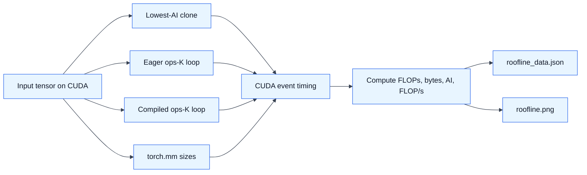

# HW1: GPU Roofline Model

## What I Do

HW1 builds a roofline plot for simple GPU kernels and matrix multiplication.
The goal is to see when work is limited by memory bandwidth and when it starts
to become compute-bound.

The implementation in `hw1/hw1_task_impl.py` does four things:

- Implements a lowest-arithmetic-intensity baseline with `x.clone()`.
- Builds configurable element-wise compute kernels using repeated
  `acc = acc * x + x` work.
- Supports both eager PyTorch and `torch.compile()` so fusion can be compared.
- Measures GPU time with CUDA events and computes FLOPs, arithmetic intensity,
  and achieved FLOP/s.

## Run

This requires a CUDA GPU supported by `hw1/hw1_runtime.py`, currently H100 or
L40S.

```bash
python hw1/hw1_task.py
```

Or through the Nebius helper script:

```bash
./scripts/run_hw1.sh
```

## Outputs

The run writes:

- `hw1/results/roofline.png`
- `hw1/results/roofline_data.json`
- `hw1/results/hw1_run.log` when run through `scripts/run_hw1.sh`

## Collected H100 Run

From `results/gpu-inference-hw-20260524-165157/hw1/hw1_run.log`:

| Point | Runtime | AI | Throughput |
| --- | ---: | ---: | ---: |
| Lowest-AI clone | 0.180 ms | 0.01 FLOP/B | 2.98 TB/s bandwidth |
| Compiled 1 ops | 0.181 ms | 0.25 FLOP/B | 0.74 TFLOP/s |
| Compiled 64 ops | 0.181 ms | 16 FLOP/B | 47.39 TFLOP/s |
| Compiled 128 ops | 0.283 ms | 32 FLOP/B | 60.70 TFLOP/s |
| Matmul 1024x1024 | 0.058 ms | 170.7 FLOP/B | 37.26 TFLOP/s |
| Matmul 4096x4096 | 2.633 ms | 682.7 FLOP/B | 52.21 TFLOP/s |

## Workflow



## Main Ideas

- Arithmetic intensity is `FLOPs / bytes`.
- Eager element-wise PyTorch launches separate kernels and materializes
  intermediates, so its estimated byte traffic is high.
- Compiled element-wise work can fuse into a smaller number of kernels, keeping
  intermediates in registers and moving rightward on the roofline as `K` grows.
- Matmul has much higher arithmetic intensity, but small matrices may still
  underutilize a large GPU. In the collected H100 run, compiled 128 ops reached
  60.70 TFLOP/s while 1024x1024 matmul reached 37.26 TFLOP/s.
