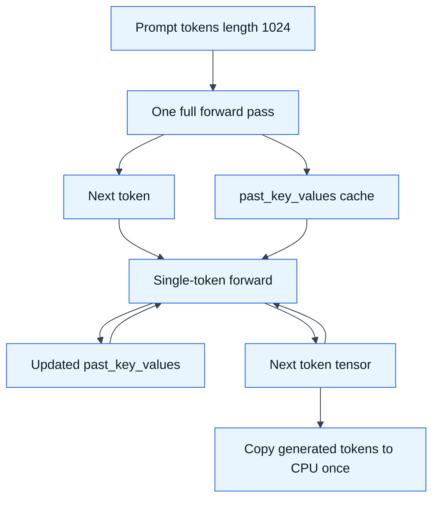
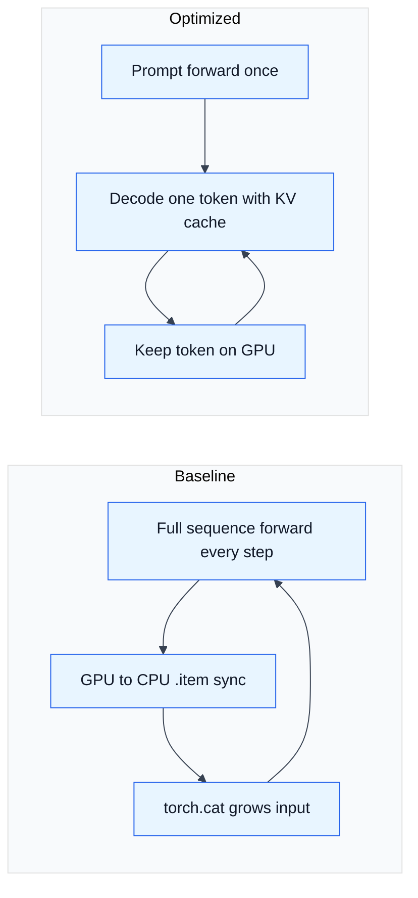

# HW2: LLM Inference Optimization

## What I Do

HW2 profiles and optimizes an autoregressive generation loop for a tiny random
Llama model. The baseline repeatedly runs the full growing sequence through the
model, extracts each token to the CPU with `.item()`, and concatenates the input
tensor every step.

The implementation in `hw2/hw2_task.py` changes that loop to:

- Run the full prompt once.
- Reuse `past_key_values` for single-token decode steps.
- Keep generated token tensors on the GPU during generation.
- Copy generated tokens to the CPU only once at the end.
- Avoid rebuilding a growing `generated_ids` tensor with `torch.cat()` each
  step.
- Load the optimized model with `float16` on CUDA.
- Export profiler traces for both baseline and optimized loops.

## Run

This requires a CUDA GPU. The grading target is calibrated against L40S.

```bash
python hw2/hw2_task.py
```

Or through the Nebius helper script:

```bash
./scripts/run_hw2.sh
```

## Outputs

The run writes:

- `hw2/results/v0_slow_trace.json`
- `hw2/results/v1_optimized_trace.json`
- `hw2/results/hw2_run.log` when run through `scripts/run_hw2.sh`

Open the trace JSON files at `https://ui.perfetto.dev` to compare baseline and
optimized execution.

## Decode Optimization



## Baseline vs Optimized



## Main Ideas

- KV caching changes decode from recomputing the full prompt every step to
  processing one token at a time.
- Avoiding `.item()` inside the loop removes a repeated CPU-GPU synchronization.
- Avoiding per-step concatenation removes repeated tensor allocation and copy
  work.
- The exact speedup should be recorded from the Nebius GPU run in the writeup
  block in `hw2/hw2_task.py`.
