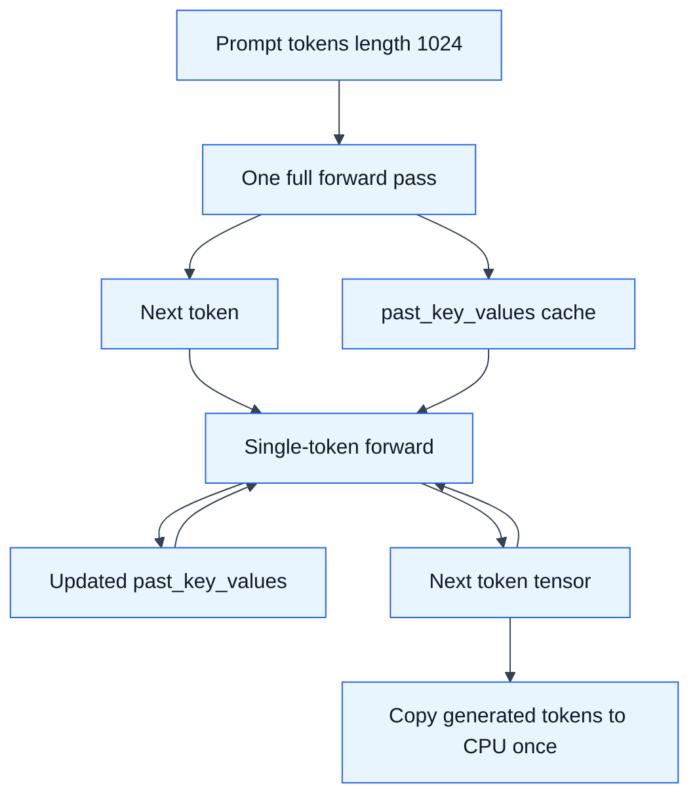
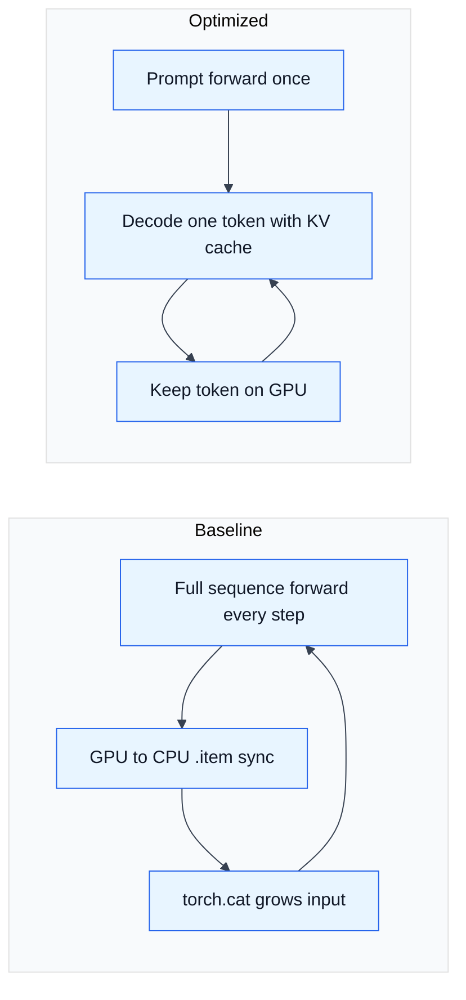

# HW2: LLM Inference Optimization

## What I Do

HW2 profiles and optimizes an autoregressive generation loop for a tiny random
Llama model. The baseline repeatedly runs the full growing sequence through the
model, extracts each token to the CPU with `.item()`, and concatenates the input
tensor every step.

The implementation in `hw2/hw2_task.py` changes that loop to:

- Run the full prompt once.
- Reuse `past_key_values` for single-token decode steps.
- Keep generated token tensors on the GPU during generation.
- Copy generated tokens to the CPU only once at the end.
- Avoid rebuilding a growing `generated_ids` tensor with `torch.cat()` each
  step.
- Load the optimized model with `float16` on CUDA.
- Export profiler traces for both baseline and optimized loops.

## Run

This requires a CUDA GPU. The grading target is calibrated against L40S.

```bash
python hw2/hw2_task.py
```

Or through the Nebius helper script:

```bash
./scripts/run_hw2.sh
```

## Outputs

The run writes:

- `hw2/results/v0_slow_trace.json`
- `hw2/results/v1_optimized_trace.json`
- `hw2/results/hw2_run.log` when run through `scripts/run_hw2.sh`

Open the trace JSON files at `https://ui.perfetto.dev` to compare baseline and
optimized execution.

## Collected H100 Run

From `results/gpu-inference-hw-20260524-165157/hw2/hw2_run.log`:

| Loop | Time for 128 tokens | Throughput | Profile CUDA time |
| --- | ---: | ---: | ---: |
| Slow baseline | 0.95 s | 134.8 tok/s | 79.964 ms |
| Optimized | 0.19 s | 668.9 tok/s | 4.617 ms |

Measured speedup:

```text
4.96x
```

The profiler table also shows why the optimization worked: slow `aten::matmul`
accounted for 70.305 ms of CUDA time in the profiled trace, while optimized
`aten::matmul` dropped to 2.017 ms because decode uses cached KV state instead
of repeatedly processing the full prompt.

## Additional Experiments

After the graded solution, I ran several experimental decode loops to see how
much more performance was available. The fastest result was `CustomKV V3`,
which bypasses most per-token Transformers wrapper/cache objects and uses
preallocated KV tensors in a tiny-Llama-specific decode path.

Using the V3 slow baseline from
`results/gpu-inference-hw-20260524-165157/hw2/hw2_optimized_v3_run.log`
(`1.006 s`, `127.5 tok/s`) as a common reference:

| Experiment | File | Time for 128 tokens | Throughput | Speedup vs slow |
| --- | --- | ---: | ---: | ---: |
| Slow baseline | `hw2_task.py` / V3 run | 1.006 s | 127.5 tok/s | 1.00x |
| Original optimized HW2 | `hw2_task.py` | 0.190 s | 668.9 tok/s | 5.29x |
| StaticCache compiled | `hw2-optimal.py` | 2.711 s | 47.2 tok/s | 0.37x |
| StaticCache eager | `hw2-optimal.py` | 0.266 s | 480.8 tok/s | 3.78x |
| DynamicCache experiment | `hw2-optimal.py` | 0.224 s | 570.3 tok/s | 4.49x |
| DynamicCache V2 | `hw2-optimized-2.py` | 0.172 s | 743.1 tok/s | 5.85x |
| DynamicCache V3 median | `hw2-optimized_v3.py` | 0.166 s | 772.7 tok/s | 6.06x |
| CustomKV V3 median | `hw2-optimized_v3.py` | 0.134 s | 957.5 tok/s | 7.51x |

The additional experiments show two useful points. First, StaticCache and
`torch.compile()` were not automatically better for this small workload:
compiled StaticCache was slower than the baseline because compilation/CUDA graph
overheads dominated. Second, the best path was reducing per-token Python and
Transformers overhead around the already-correct KV-cache decode. `CustomKV V3`
was 1.24x faster than DynamicCache V3 and 1.42x faster than the original graded
optimized loop.

## Decode Optimization



## Baseline vs Optimized



## Main Ideas

- KV caching changes decode from recomputing the full prompt every step to
  processing one token at a time.
- Avoiding `.item()` inside the loop removes a repeated CPU-GPU synchronization.
- Avoiding per-step concatenation removes repeated tensor allocation and copy
  work.
- The collected H100 run reached 4.96x speedup, crossing the “Great” tier in
  the homework rubric.
- Extra experiments pushed the best measured decode loop to 0.134 s for 128
  tokens, or 957.5 tok/s, with a custom preallocated-KV path.
