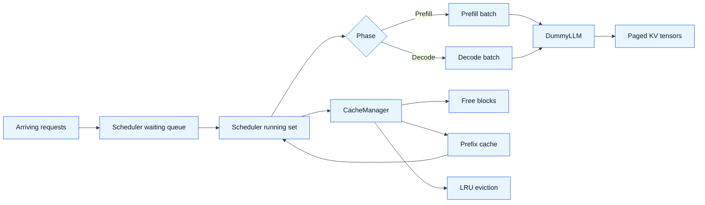
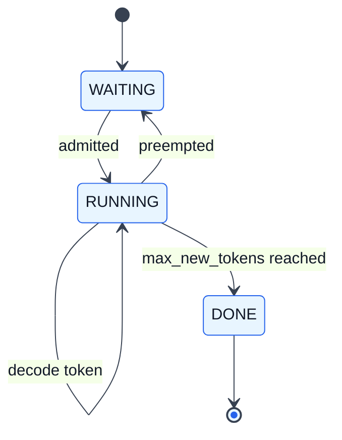
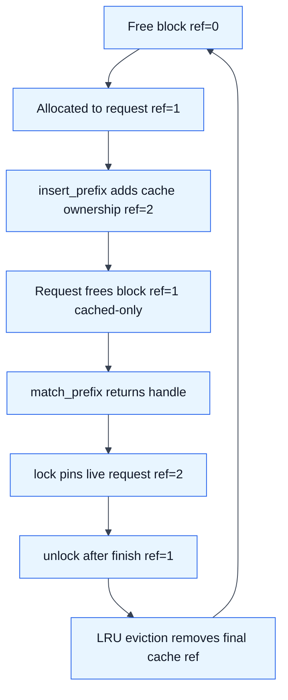

# HW3: Mini Inference Engine

## What I Do

HW3 implements the memory and scheduling core of a tiny LLM inference engine.
It runs on CPU, so it can be tested locally, but it models real serving concepts:
paged KV memory, prefix caching, LRU eviction, prefill/decode batching, and
preemption under memory pressure.

The implementation in `hw3/hw3_task.py` includes:

- `CacheManager.allocate()` and `free()` for physical KV block ownership.
- Prefix-cache lookup with longest complete-block matching.
- Prefix insertion with correct overlapping cache reference counts.
- LRU eviction of cached-only blocks.
- Cache `lock()` and `unlock()` so live requests pin reused prefix blocks.
- FIFO admission from waiting to running.
- Prefill and decode phase selection for `PREFILL_FIRST` and `DECODE_FIRST`.
- Decode-time block allocation only when crossing a block boundary.
- Preemption when neither free blocks nor eviction can satisfy allocation.
- Writeup answers based on the collected full HW3 run.

## Run

HW3 can run locally or on the Nebius VM.

```bash
python -m pytest \
  hw3/test_cache_manager_correctness.py \
  hw3/test_scheduler_correctness.py \
  hw3/test_hw3_correctness.py \
  -q

python hw3/hw3_task.py
```

Or through the Nebius helper script:

```bash
./scripts/run_hw3.sh
```

## Outputs

The full run writes:

- `hw3/results/hw3_results.png`
- `hw3/results/hw3_policy_results.png`
- `hw3/results/hw3_tests.log` when run through `scripts/run_hw3.sh`
- `hw3/results/hw3_run.log` when run through `scripts/run_hw3.sh`

## Collected Run

From `hw3/results/hw3_run.log`:

| Workload | Prefix cache | Steps | Throughput | TTFT mean/p95 | E2E mean | Preemptions | Prefix saved |
| --- | --- | ---: | ---: | ---: | ---: | ---: | ---: |
| Prefill-Heavy | Off | 697 | 10.58 tok/step | 233.0 / 483.8 | 360.6 | 91 | 0 |
| Prefill-Heavy | On | 284 | 25.97 tok/step | 48.1 / 99.2 | 152.3 | 18 | 11008 |
| Decode-Heavy | Off | 1511 | 9.87 tok/step | 737.7 / 1035.6 | 1084.2 | 273 | 0 |
| Decode-Heavy | On | 1095 | 13.62 tok/step | 430.8 / 666.3 | 773.1 | 159 | 1920 |

Policy comparison with prefix caching enabled:

| Workload | Policy | Steps | TTFT mean | E2E mean |
| --- | --- | ---: | ---: | ---: |
| Prefill-Heavy | Prefill-first | 284 | 48.1 | 152.3 |
| Prefill-Heavy | Decode-first | 409 | 100.4 | 191.6 |
| Decode-Heavy | Prefill-first | 1095 | 430.8 | 773.1 |
| Decode-Heavy | Decode-first | 1105 | 434.2 | 731.5 |

## Engine Structure



## Request Lifecycle



## Cache Block Lifecycle



## Main Ideas

- Only complete prompt blocks are cached.
- Cache lookup does not pin blocks by itself; the scheduler must lock the
  returned handle while the request is live.
- `_cache_ref` counts how many cache entries mention a block, while `_ref`
  answers whether a block is free, cached-only, or pinned.
- Prefix caching is most valuable when many requests share long prompts. In the
  collected run, the prefill-heavy workload used 2.45x fewer steps with caching,
  while the decode-heavy workload used 1.38x fewer steps.
- Prefill-first tends to improve admission and TTFT; decode-first tends to
  prioritize already-streaming requests.
